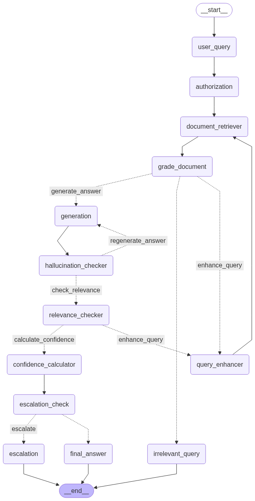

# 🤖 NovaCorp HR Assistant - RAG-Powered AI Chat System

An intelligent HR assistant that helps employees, managers, and HR professionals quickly find answers to workplace questions using advanced AI and document retrieval technology.

## 📸 System Architecture



_The AI workflow automatically processes your questions, retrieves relevant information from company documents, and provides accurate, context-aware responses._

## ✨ What Does This Do?

This HR Assistant can help you with:

- **📚 Company Policies**: Get instant answers about leave policies, benefits, and procedures
- **👥 Employee Guidelines**: Understand performance reviews, workplace conduct, and career development
- **💼 Management Support**: Access guidance for team leadership, hiring processes, and decision-making
- **🔐 Role-Based Access**: Different information access levels for employees, managers, and HR staff
- **📊 Confidence Scoring**: See how confident the AI is in its answers
- **🔍 Source Citations**: View exactly which documents the answers come from

## 🏗️ How It Works

### The Smart Workflow Process:

1. **🎯 Authorization**: Determines your role (Employee/Manager/HR) and access level
2. **📝 Question Processing**: Analyzes and improves your question for better results
3. **🔍 Document Retrieval**: Searches through company documents using advanced AI
4. **✅ Quality Check**: Verifies the relevance and quality of found information
5. **🤖 Answer Generation**: Creates a clear, helpful response tailored to your role
6. **🎚️ Confidence Assessment**: Rates how confident the system is in the answer
7. **📋 Final Validation**: Ensures the response meets quality standards

### Technology Stack:

- **Frontend**: Next.js with modern React components
- **Backend**: FastAPI with LangGraph workflow engine
- **AI**: OpenAI GPT models for intelligent responses
- **Search**: Pinecone vector database for fast document retrieval
- **Deployment**: Vercel (frontend) + Render (backend)

## 🚀 Quick Start

### For Users (No Installation Needed):

1. Visit the deployed web application
2. Select your role (Employee/Manager/HR)
3. Ask any HR-related question
4. Get instant, accurate answers with source references

### For Developers:

#### Prerequisites:

- Python 3.8+
- Node.js 18+
- OpenAI API key
- Pinecone account

#### Local Development Setup:

**1. Clone the Repository:**

```bash
git clone https://github.com/yashusinghal69/RAG-for-HRs-and-Managers.git
cd RAG-for-HRs-and-Managers
```

**2. Backend Setup:**

```bash
# Navigate to workflow directory
cd workflow

# Create virtual environment
python -m venv .venv
.venv\Scripts\activate  # Windows
# or
source .venv/bin/activate  # macOS/Linux

# Install dependencies
pip install -r requirements.txt

# Create environment file
copy .env.example .env

# Add your API keys to .env:
# OPENAI_API_KEY=your_openai_key
# PINECONE_API_KEY=your_pinecone_key
# PINECONE_INDEX_NAME=hr-rag-index

# Run the backend
python api_server.py
```

**3. Frontend Setup:**

```bash
# Open new terminal and navigate to frontend
cd frontend

# Install dependencies
npm install

# Create environment file
copy .env.example .env.local

# For local development, add:
# NEXT_PUBLIC_FASTAPI_URL=http://localhost:8000

# Start the frontend
npm run dev
```

**4. Access the Application:**

- Frontend: http://localhost:3000
- Backend API: http://localhost:8000
- API Documentation: http://localhost:8000/docs

## 🌐 Deployment Guide

### Backend Deployment (Render):

1. **Connect to Render:**

   - Go to [render.com](https://render.com)
   - Create new Web Service
   - Connect your GitHub repository

2. **Configure Service:**

   ```
   Name: novacorp-rag-backend
   Environment: Python 3
   Root Directory: workflow
   Build Command: ./build.sh
   Start Command: ./start.sh
   ```

3. **Environment Variables:**

   ```
   OPENAI_API_KEY=your_key_here
   PINECONE_API_KEY=your_key_here
   PINECONE_INDEX_NAME=hr-rag-index
   PORT=10000
   ```

4. **Deploy**: Your backend will be available at `https://your-app.onrender.com`

### Frontend Deployment (Vercel):

1. **Connect to Vercel:**

   - Go to [vercel.com](https://vercel.com)
   - Connect your GitHub repository
   - Select the `frontend` folder as root directory

2. **Configure Settings:**

   ```
   Framework: Next.js
   Root Directory: frontend
   Build Command: npm run build
   Output Directory: .next
   ```

3. **Environment Variables:**

   ```
   NEXT_PUBLIC_FASTAPI_URL=back_end_deployed_url
   ```

4. **Deploy**: Your frontend will be available at `https://your-app.vercel.app`

## 📁 Project Structure

```
RAG-for-HRs-and-Managers/
├── 📁 workflow/              # AI Backend (Python)
│   ├── api_server.py         # FastAPI web server
│   ├── graph.py             # LangGraph workflow logic
│   ├── main.py              # Main workflow runner
│   ├── nodes/               # Individual workflow steps
│   └── utils/               # Helper functions
├── 📁 frontend/             # Web Interface (Next.js)
│   ├── src/
│   │   ├── app/            # Next.js app router pages
│   │   ├── components/     # React components
│   │   └── lib/           # Utility functions
│   └── public/            # Static assets
├── 📁 Documents/           # Company documents for AI training
└── 📁 Data_ingestion_Workflow/  # Document processing scripts
```

## 🔧 Configuration

### Supported Document Types:

- PDF files (employee handbooks, policy documents)
- Text files (procedures, guidelines)
- Structured data (FAQs, templates)

### Role-Based Access Levels:

- **Employee**: Basic HR information and personal policies
- **Manager**: Team management guidance and leadership resources
- **HR**: Full access to all policies and administrative procedures

### AI Model Settings:

- **Language Model**: OpenAI GPT-4 for response generation
- **Embeddings**: OpenAI text-embedding-ada-002 for document search
- **Vector Database**: Pinecone for fast similarity search
- **Confidence Threshold**: Configurable minimum confidence for responses

